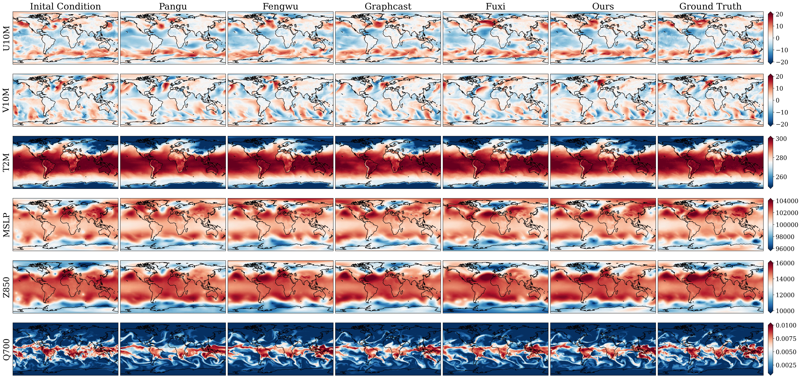
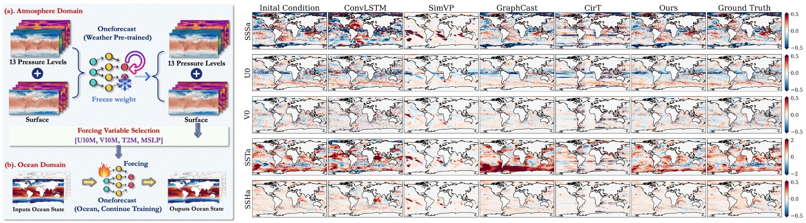

 
 # <p align=center>  [ICML 2025] OneForecast</p>

 <div align="center">
 
[](https://arxiv.org/abs/2502.00338)
[](https://openreview.net/forum?id=9xGSeVolcN)
[](https://huggingface.co/YuanGao-YG/OneForecast/tree/main)

</div>
<div align=center>

</div>

---
>**OneForecast: A Universal Framework for Global and Regional Earth System Forecasting**<br>  [Yuan Gao](https://scholar.google.com.hk/citations?hl=zh-CN&user=4JpRnU4AAAAJ&view_op=list_works&sortby=pubdate)<sup>† </sup>, [Hao Wu](https://alexander-wu.github.io/)<sup>† </sup><sup>‡ </sup>, [Fan Zhang](https://scholar.google.com.hk/citations?user=KbC_-7cAAAAJ&hl=zh-CN&oi=sra), [Haoxuan Li](https://scholar.google.com.hk/citations?user=gtDqiucAAAAJ&hl=zh-CN&oi=ao), [Fan Xu](https://scholar.google.com.hk/citations?hl=zh-CN&user=qfMSkBgAAAAJ&view_op=list_works&sortby=pubdate), [Qingsong Wen](https://sites.google.com/site/qingsongwen8/), [Huanshuo Dong](https://scholar.google.com.hk/citations?hl=zh-CN&user=VdGW_n8AAAAJ&view_op=list_works&sortby=pubdate), [Yibo Yan](https://scholar.google.com.hk/citations?hl=zh-CN&user=26yPSEcAAAAJ&view_op=list_works&sortby=pubdate), [Xuming Hu](https://xuminghu.github.io/), [Jiahao Wu](https://scholar.google.com/citations?user=GuQ10J4AAAAJ&hl=zh-CN), [Qing Li](https://www4.comp.polyu.edu.hk/~csqli/), [Hui Xiong](https://scholar.google.com.hk/citations?hl=zh-CN&user=cVDF1tkAAAAJ&view_op=list_works&sortby=pubdate), [Zhouchen Lin](https://scholar.google.com.hk/citations?user=TanjFwoAAAAJ&hl=zh-CN&oi=ao), [Kun Wang](https://scholar.google.com/citations?user=UnyqjWQAAAAJ&hl=en&oi=sra)<sup>* </sup>,  [Xiaomeng Huang](http://faculty.dess.tsinghua.edu.cn/huangxiaomeng/en/index.htm)<sup>* </sup> <br>
(† Equal contribution, ‡ Project lead and technical guidance, * Corresponding author)<br>

> **Abstract:** *Accurate earth system forecasts are important for disaster prevention, agricultural planning, etc. Traditional numerical weather prediction (NWP) methods offer physically interpretable high-accuracy predictions but are computationally expensive and fail to fully leverage rapidly growing historical data. In recent years, deep learning models have made significant progress in earth system forecasting, but challenges remain, such as balancing global and regional high-resolution forecasts, excessive smoothing in extreme event predictions, and insufficient dynamic system modeling. To address these issues, this paper proposes a global-regional nested earth system forecasting framework (OneForecast) based on graph neural networks. By combining a dynamic system perspective with multi-grid theory, we construct a multi-scale graph structure and densify the target region to capture local high-frequency features. We introduce an adaptive messaging mechanism using dynamic gating units to deeply integrate node and edge features, and theoretically prove its high-pass filtering property to mitigate over-smoothing issues. For high-resolution regional forecasts, we propose a neural nested grid method to mitigate boundary information loss. Furthermore, we extend the framework to cross-sphere modeling by introducing a causally-coupled ocean-atmosphere strategy, enabling accurate ocean forecasting driven by dynamic atmospheric forcing. Experimental results show that OneForecast performs excellently across global to regional scales, from atmospheric to oceanic domains, and short-term to long-term forecasts, especially in extreme event predictions. Codes link: \url{https://github.com/YuanGao-YG/OneForecast}.*

---
>**[ICML 2025] OneForecast: A Universal Framework for Global and Regional Weather Forecasting**<br>  [Yuan Gao](https://scholar.google.com.hk/citations?hl=zh-CN&user=4JpRnU4AAAAJ&view_op=list_works&sortby=pubdate)<sup>† </sup>, [Hao Wu](https://alexander-wu.github.io/)<sup>† </sup>, [Ruiqi Shu](https://scholar.google.com.hk/citations?user=WKBB3r0AAAAJ&hl=zh-CN&oi=sra)<sup>† </sup>, [Huanshuo Dong](https://scholar.google.com.hk/citations?hl=zh-CN&user=VdGW_n8AAAAJ&view_op=list_works&sortby=pubdate), [Fan Xu](https://scholar.google.com.hk/citations?hl=zh-CN&user=qfMSkBgAAAAJ&view_op=list_works&sortby=pubdate), [Rui Ray Chen](https://scholar.google.com.hk/citations?hl=zh-CN&user=hM32GugAAAAJ&view_op=list_works&sortby=pubdate), [Yibo Yan](https://scholar.google.com.hk/citations?hl=zh-CN&user=26yPSEcAAAAJ&view_op=list_works&sortby=pubdate), [Qingsong Wen](https://sites.google.com/site/qingsongwen8/), [Xuming Hu](https://xuminghu.github.io/), [Kun Wang](https://scholar.google.com/citations?user=UnyqjWQAAAAJ&hl=en&oi=sra), [Jiahao Wu](https://scholar.google.com/citations?user=GuQ10J4AAAAJ&hl=zh-CN), [Qing Li](https://www4.comp.polyu.edu.hk/~csqli/), [Hui Xiong](https://scholar.google.com.hk/citations?hl=zh-CN&user=cVDF1tkAAAAJ&view_op=list_works&sortby=pubdate), [Xiaomeng Huang](http://faculty.dess.tsinghua.edu.cn/huangxiaomeng/en/index.htm)<sup>* </sup> <br>
(† Equal contribution, * Corresponding author)<br>


> **Abstract:** *Accurate weather forecasts are important for disaster prevention, agricultural planning, etc. Traditional numerical weather prediction (NWP) methods offer physically interpretable high-accuracy predictions but are computationally expensive and fail to fully leverage rapidly growing historical data. In recent years, deep learning models have made significant progress in weather forecasting, but challenges remain, such as balancing global and regional high-resolution forecasts, excessive smoothing in extreme event predictions, and insufficient dynamic system modeling. To address these issues, this paper proposes a global-regional nested weather forecasting framework (OneForecast) based on graph neural networks. By combining a dynamic system perspective with multi-grid theory, we construct a multi-scale graph structure and densify the target region to capture local high-frequency features. We introduce an adaptive messaging mechanism, using dynamic gating units to deeply integrate node and edge features for more accurate extreme event forecasting. For high-resolution regional forecasts, we propose a neural nested grid method to mitigate boundary information loss. Experimental results show that OneForecast performs excellently across global to regional scales and short-term to long-term forecasts, especially in extreme event predictions. Codes link: \url{https://github.com/YuanGao-YG/OneForecast}.*
---

## News 🚀
* **2026.01.07**: We release proprocessed data (training and validing) for global weather forecasting on [Hugging Face](https://huggingface.co/YuanGao-YG/OneForecast/upload/main/data/global/).
* **2025.12.05**: We extend this framework to cross-sphere modeling by introducing a causally-coupled ocean-atmosphere strategy.
* **2025.06.03**: Training codes are released.
* **2025.05.01**: OneForecast is accepted by [ICML 2025](https://icml.cc/).
* **2025.02.15**: Inference codes, pre-trained weights, and test data are released.
* **2025.02.03**: Codes for models are released.
* **2025.02.01**: Paper is released on [arXiv](http://arxiv.org/abs/2502.00338).

## Notes

The intact project is avilable on [Hugging Face](https://huggingface.co/YuanGao-YG/OneForecast/tree/main), you can find the pretrained models, test data on Hugging Face and put them in the same location.


## Quick Start

### Installation

- cuda 11.8

```
# git clone this repository
git clone https://github.com/YuanGao-YG/OneForecast.git
cd OneForecast

# create new anaconda env
conda env create -f environment.yml
conda activate oneforecast
```


### Inference

1. Global Forecasts Inference

(1) Preparing the test data as follows:

```
./data/
|--global
|  |--test
|  |  |--2020.h5
|  |--mean.npy
|  |--std.npy
```

(2) Inference with 1-step supervised pretrained ckpt:
```
sh inference.sh
```

(3) Inference with finetuned pretrained ckpt:
```
sh inference_finetune.sh
```

2. Regional Forecasts Inference

(1) Preparing the test data as follows:

```
./data/
|--global
|  |--test
|  |  |--2020.h5
|  |--mean.npy
|  |--std.npy
|--regional
|  |--test
|  |  |--2020.h5
```

(2) Inference with 1-step supervised pretrained ckpt:

```
sh inference_nng.sh
```


3. Causally-coupled Ocean-atmosphere Forecasting Inference

We will release the corrsponding codes after the expanded version of the paper is accepted. 
   
## Training

### Global Forecasts

**1. Prepare Data**

Preparing the train, valid, and test data as follows:

```
./data/
|--global
|  |--train
|  |  |--1959.h5
|  |  |--1960.h5
|  |  |--.......
|  |  |--2016.h5
|  |  |--2017.h5
|  |--valid
|  |  |--2017.h5
|  |  |--2018.h5
|  |--test
|  |  |--2020.h5
|  |--mean.npy
|  |--std.npy
```

Each h5 file includes a key named 'fields' with the shape [T, C, H, W] (T=1460/1464, C=69, H=121, W=240). We relese all training data on the [Hugging Face](https://huggingface.co/YuanGao-YG/OneForecast/tree/main/data/global/train). The order of all variables is as follows:

```
var_idex = {
        "Z50":0, "Z100":1, "Z150":2, "Z200":3, "Z250":4, "Z300":5, "Z400":6, "Z500":7, "Z600":8, "Z700":9, "Z850":10, "Z925":11, "Z1000":12,
        "Q50":13, "Q100":14, "Q150":15, "Q200":16, "Q250":17, "Q300":18, "Q400":19, "Q500":20, "Q600":21, "Q700":22, "Q850":23, "Q925":24, "Q1000":25,
        "T50":26, "T100":27, "T150":28, "T200":29, "T250":30, "T300":31, "T400":32, "T500":33, "T600":34, "T700":35, "T850":36, "T925":37, "T1000":38,
        "U50":39, "U100":40, "U150":41, "U200":42, "U250":43, "U300":44, "U400":45, "U500":46, "U600":47, "U700":48, "U850":49, "U925":50, "U1000":51,
        "V50":52, "V100":53, "V150":54, "V200":55, "V250":56, "V300":57, "V400":58, "V500":59, "V600":60, "V700":61, "V850":62, "V925":63, "V1000":64,
        "U10M":65, "V10M":66, "T2M":67, "MSLP":68,
}
```
Regarding the meaning of abbreviated variables, for example, "Z50" means Geopotential at 50 hPa.

**2. Model Training with 1-step Supervision**

- **Multi-node Multi-GPU Training**

```
sh train.sh
```

**3. Model Training with Multi-step Supervision Finetune**

- **Multi-node Multi-GPU Training**

(1) Modify `./train_finetune.sh` file and `./config/Model.yaml` file.

For instance, if you intent to finetune ckpt from 1-step ckpt (the start training time is 20250603-190101) with 2-step finetune for 10 eppchs, you can set `run_num='20250603-190101'`, `multi_steps_finetune=2`, `finetune_max_epochs=10`, `lr: 1E-6`. Please note that using a small learning rate (lr) to finetune model may contribute to convergence, you can adjust it according to your total batch size.

If you intent to finetune ckpt from 2-step ckpt (the start training time is 20250603-190101) with 3-step finetune for 10 eppchs, you can set `run_num='20250603-190101'`, `multi_steps_finetune=3`, `finetune_max_epochs=10`, `lr: 1E-6`.

(2) Run the following script:

```
sh train_finetune.sh
```

### Regional Forecasts 

**1. Prepare Data**

Preparing the train, valid, and test data as follows:

```
./data/
|--global
|  |--train
|  |  |--1959.h5
|  |  |--1960.h5
|  |  |--.......
|  |  |--2016.h5
|  |  |--2017.h5
|  |--valid
|  |  |--2017.h5
|  |  |--2018.h5
|  |--test
|  |  |--2020.h5
|  |--mean.npy
|  |--std.npy
|--regional
|  |--train
|  |  |--1959.h5
|  |  |--1960.h5
|  |  |--.......
|  |  |--2016.h5
|  |  |--2017.h5
|  |--valid
|  |  |--2017.h5
|  |  |--2018.h5
|  |--test
|  |  |--2020.h5
```

Each h5 file includes a key named 'fields' with the shape [T, C, H, W] (T=1460/1464, C=69, H=721, W=1440)


**2. Model Training**

- **Multi-node Multi-GPU Training**

(1) Modify `./train_nng.sh` file and `./config/Model_nng.yaml` file.

Before training the regional model, a pretrained global ckpt is necessary. For instance, if you intent to train the regional model using global model (the start training time is 20250603-190101) as forecing, you can set `run_num='20250603-190101'`, `multi_steps_finetune=1`, `finetune_max_epochs=200`, `lr: 1E-3`. You can also adjust the learning rate (lr) according to your total batch size.

(2) Run the following script:

```
sh train_nng.sh
```

### Causally-coupled Ocean-atmosphere Forecasts

We will release the corrsponding codes after the expanded version of the paper is accepted. 


## Performance
### Global Forecasts

</div>
<div align=center>

</div>

</div>
<div align=center>

</div>

</div>
<div align=center>

</div>

### Regional Forecasts

</div>
<div align=center>

</div>

### Causally-coupled Ocean-atmosphere Forecasting

</div>
<div align=center>

</div>

### Extreme Event Forecasts (Typhoon)

</div>
<div align=center>

</div>


## Citation

```
@article{gao2025oneforecast,
  title={OneForecast: A Universal Framework for Global and Regional Weather Forecasting},
  author={Gao, Yuan and Wu, Hao and Shu, Ruiqi and Dong, Huanshuo and Xu, Fan and Chen, Rui and Yan, Yibo and Wen, Qingsong and Hu, Xuming and Wang, Kun and others},
  journal={arXiv preprint arXiv:2502.00338},
  year={2025}
}
```

## Acknowledgement

We appreciate the following open-sourced repositories for their valuable code base:

[https://github.com/NVlabs/FourCastNet](https://github.com/NVlabs/FourCastNet)

[https://github.com/NVIDIA/physicsnemo](https://github.com/NVIDIA/physicsnemo)


#### If you have any questions, please contact [yuangao24@mails.tsinghua.edu.cn](mailto:yuangao24@mails.tsinghua.edu.cn), [wuhao2022@mail.ustc.edu.cn](mailto:wuhao2022@mail.ustc.edu.cn).

