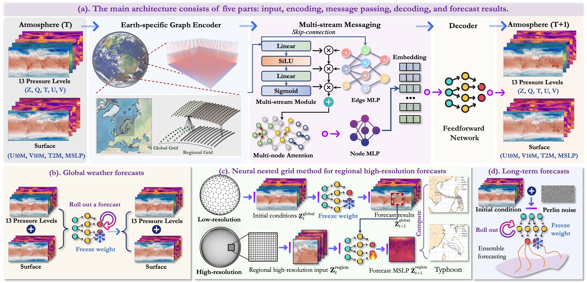
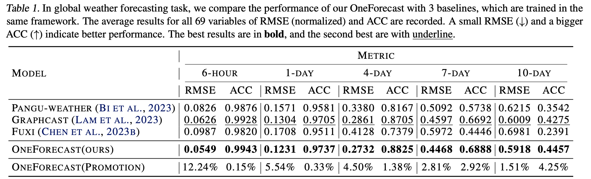
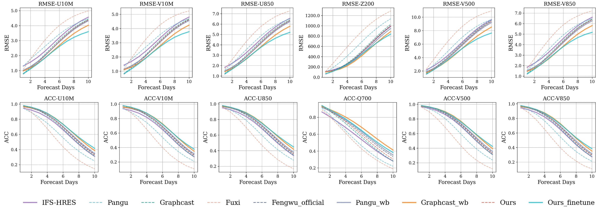
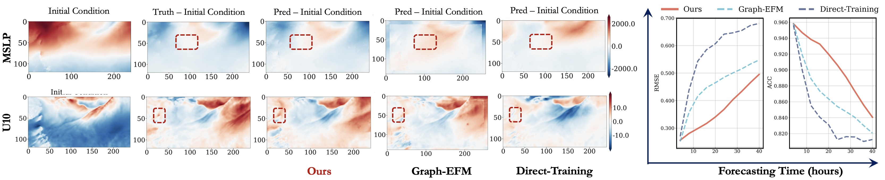
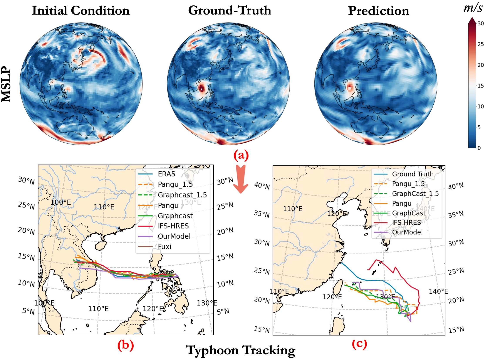

 # <p align=center> OneForecast: A Universal Framework for Global and Regional Weather Forecasting</p>

</div>
<div align=center>

</div>

---
>**OneForecast: A Universal Framework for Global and Regional Weather Forecasting**<br>  [Yuan Gao](https://scholar.google.com.hk/citations?hl=zh-CN&user=4JpRnU4AAAAJ&view_op=list_works&sortby=pubdate)<sup>† </sup>, [Hao Wu](https://easylearningscores.github.io/)<sup>† </sup>, Ruiqi Shu<sup>† </sup>, Huanshuo Dong, [Fan Xu](https://scholar.google.com.hk/citations?hl=zh-CN&user=qfMSkBgAAAAJ&view_op=list_works&sortby=pubdate), Rui Chen, [Yibo Yan](https://scholar.google.com.hk/citations?hl=zh-CN&user=26yPSEcAAAAJ&view_op=list_works&sortby=pubdate), [Qingsong Wen](https://sites.google.com/site/qingsongwen8/), [Xuming Hu](https://xuminghu.github.io/), [Kun Wang](https://scholar.google.com/citations?user=UnyqjWQAAAAJ&hl=en&oi=sra), [Jiahao Wu](https://scholar.google.com/citations?user=GuQ10J4AAAAJ&hl=zh-CN), [Qing Li](https://www4.comp.polyu.edu.hk/~csqli/), [Hui Xiong](https://scholar.google.com.hk/citations?hl=zh-CN&user=cVDF1tkAAAAJ&view_op=list_works&sortby=pubdate), [Xiaomeng Huang](http://faculty.dess.tsinghua.edu.cn/huangxiaomeng/en/index.htm)<sup>* </sup> <br>
(† Equal contribution, * Corresponding Author)<br>


> **Abstract:** *Accurate weather forecasts are important for disaster prevention, agricultural planning, and water resource management. Traditional numerical weather prediction (NWP) methods offer physically interpretable high-accuracy predictions but are computationally expensive and fail to fully leverage rapidly growing historical data. In recent years, deep learning methods have made significant progress in weather forecasting, but challenges remain, such as balancing global and regional high-resolution forecasts, excessive smoothing in extreme event predictions, and insufficient dynamic system modeling. To address these issues, this paper proposes a global-regional nested weather forecasting framework based on graph neural networks (GNNs). By combining a dynamic system perspective with multi-grid theory, we construct a multi-scale graph structure and densify the target region to capture local high-frequency features. We introduce an adaptive information propagation mechanism, using dynamic gating units to deeply integrate node and edge features for more accurate extreme event forecasting. For high-resolution regional forecasts, we propose a neural nested grid method to mitigate boundary information loss. Experimental results show that the proposed method performs excellently across global to regional scales and short-term to long-term forecasts, especially in extreme event predictions (e.g., typhoons), significantly improving forecast accuracy.*
---

## News 🚀

* **2025.02.03**: Codes for models are released.
* **2025.02.03**: Paper is released on ArXiv.

## Quick Start

### Install

continue update

### Pretrained Models

continue update

### Inference

continue update

## Performance

### Global Forecasting

</div>
<div align=center>

</div>

</div>
<div align=center>

</div>

</div>
<div align=center>

</div>

### Regional Forecasting

</div>
<div align=center>

</div>

### Extreme Event Forecasting

</div>
<div align=center>

</div>


## Citation

```
@article{gao2025oneforecast,
  title={OneForecast: A Universal Framework for Global and Regional Weather Forecasting},
  author={Gao Yuan, Wu Hao, Shu Ruiqi, Dong Huanshuo, Xu Fan, Chen Rui, Yan Yibo, Wen Qingsong, Hu Xuming, Wang Kun, Wu Jiahao, Li Qing, Hui Xiong, and Huang Xiaomeng},
  journal={xx},
  year={2024}
}
```

#### If you have any questions, please contact [yuangao24@mails.tsinghua.edu.cn](mailto:yuangao24@mails.tsinghua.edu.cn).

**Acknowledgment:** This code is based on the [NVIDIA modulus](https://github.com/NVIDIA/modulus)
